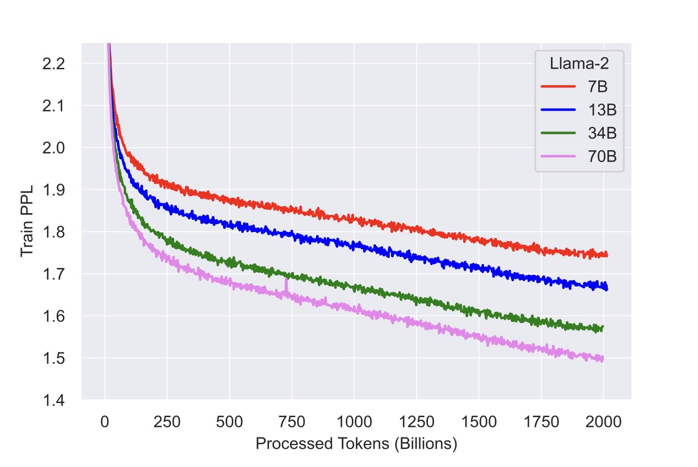
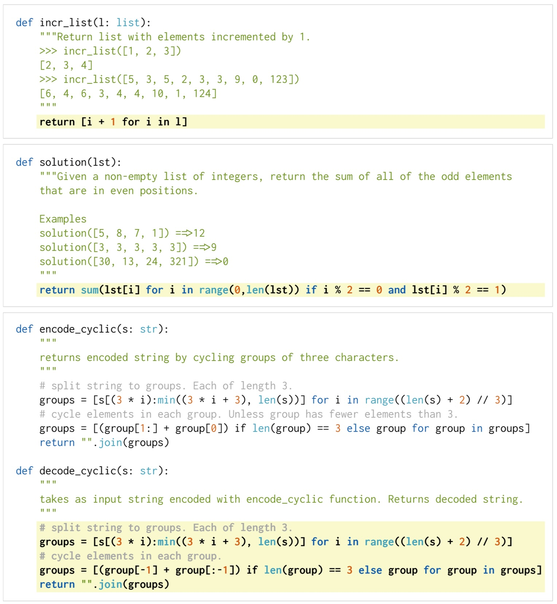

Paper Reading Notes, Q4 2023
===============================

llama 2
--------
Comparing to llama 1, there's a lot less information about model details and training data, which makes it intentionally hard to reproduce the results. 
But we can just refer those details from llama 1 as lots of the parts should be the same.
In this note, we will mainly focus on:

1. Modern tricks used by the model and pre triaining
2. Analysis of evaluation metrics and results used in the paper
3. Methods of Supervised Fine Tuning, RLHF
4. Model behavior analysis 

Modern Tricks
^^^^^^^^^^^^^

Comparing to llama 1, llama 2 mainly have 3 new tricks: 
``RMSNorm pre-normalization`` ``SwiGLU activation function`` ``rotary position embedding`` and ``grouped-query attention (GQA)``
We will discuss them one by one.

``RMSNorm`` `Paper <https://arxiv.org/abs/1910.07467>`_ 

In standard ``Layer Normalization``, the mean and variance are computed across all the features for each data sample in a batch,
and these statistics are used to normalize the data. 
This process helps in addressing the issue of internal covariate shift, where the distribution of each layer's inputs changes during training, 
making the training process more stable and faster.

.. math::

    x_i = \frac{x_i - \mu}{\sqrt{\sigma^2 + \epsilon}}

``RMSNorm`` simplifies the normalization process used in Layer Normalization. 
Unlike LayerNorm, which normalizes based on both the mean and variance of a layer's inputs, 
RMSNorm only uses the root mean square (RMS) value, essentially the standard deviation without subtracting the mean.

.. math::

    \text{RMS} = \sqrt{\frac{1}{n} \sum_{i=1}^{n} x_i^2}   

    x_i = \frac{x_i}{\sqrt{\text{RMS}^2 + \epsilon}}

Why RMSNorm Might Be Better?

* Simplification: RMSNorm simplifies the computation by eliminating the need to calculate the mean. This can lead to minor computational efficiency improvements.
* Stability in Training: It has been observed in some cases that RMSNorm can provide more stable training for deep networks. This is particularly relevant in architectures like Transformers where Layer Normalization plays a crucial role.
* Effectiveness in Deep Networks: Some studies suggest that RMSNorm can be more effective than LayerNorm in very deep networks, potentially due to its simpler normalization dynamic.
* Robustness: RMSNorm might offer more robustness in scenarios where the mean calculation in LayerNorm could introduce instability.

``pre-normalization``

Pre-normalization:
In pre-normalization (PreNorm), normalization is applied to the input of a sub-layer (such as a self-attention or feed-forward layer) before the actual operation of the sub-layer. 
The typical structure of a PreNorm layer in a Transformer model would be:

1. Normalize the input.
2. Apply the sub-layer operation (like attention or feed-forward).
3. Add the result to the original input (residual connection).
The PreNorm structure can be represented as:

.. math::

    \text{Output} = \text{SubLayer}(\text{Normalize}(X)) + X

Post-normalization:
Post-normalization (PostNorm), on the other hand, applies normalization after the sub-layer operation. This is the approach originally used in the Transformer model by Vaswani et al. The structure is:

1. Apply the sub-layer operation.
2. Add the output to the original input (residual connection).
3. Normalize this result.
The PostNorm structure can be represented as:

.. math::

    \text{Output} = \text{Normalize}(\text{SubLayer}(X) + X)

Comparison:
* Stability in Training: PreNorm is often found to be more stable in training, especially for very deep models. It can lead to faster convergence and is less sensitive to hyperparameter choices.
* Performance: The performance of PreNorm versus PostNorm can depend on the specific task and model architecture. In some cases, PostNorm might yield slightly better results, whereas in others, PreNorm is superior.
* Gradient Flow: PreNorm can help with the flow of gradients through the network, potentially alleviating issues with vanishing or exploding gradients in very deep networks.
* Implementation Ease: PreNorm might be easier to implement, especially in architectures where layers are added or removed dynamically, as it avoids the need to handle normalization at the beginning and end of sequences of layers.

``SwiGLU activation function``
`Paper <https://arxiv.org/abs/2002.05202>`_

Swish-Gated Linear Unit (SwiGLU) is a new activation function that combines the Swish and GLU activation functions.
Just another Highly mathmaticallly complicated activation function which is better, it is very hard for us to understand.

``rotary position embedding (RoPE)``
`Paper <https://arxiv.org/abs/2104.09864>`_

TBD 

``grouped-query attention (GQA)``

TBD

Pre-training details
^^^^^^^^^^^^^^^^^^^^^^^^^
Tokenizer: `bytepair encoding` (BPE) algorithm (Sennrich et al., 2016) using the implementation from `SentencePiece` (Kudo and Richardson, 2018).
Plus split all numbers into **individual** digits and use bytes to **decompose** unknown UTF-8 characters. The total vocabulary size is **32k** tokens.

Optimizer: AdamW with  ``beta1=0.9``, ``beta2=0.95``, ``epsilon=1e-5``

Learning rate schedule: ``warmup_steps=2000``, ``minimum = 1e-6``

Weight decay: ``0.1``, Gradient clipping: ``1.0``

Loss Function: Perplexity (PPL)

TBD, also note ``BLEU`` even tho its not used

Loss Progression:

Pre-Training Time (2T tokens):

+-------------+------------+--------------------+---------+-----------------------+
|             | A100 Hours | 8*A100 Node Months | $ (aws) | token*BParam/sec/A100 |
+=============+============+====================+=========+=======================+
| LLAMA 2 7B  | 184,320    | 32                 | $1M     | 21098                 |
+-------------+------------+--------------------+---------+-----------------------+
| LLAMA 2 13B | 368,640    | 64                 | $2M     | 19591                 |
+-------------+------------+--------------------+---------+-----------------------+
| LLAMA 2 34B | 1,038,336  | 180                | $6M     | 18191                 |
+-------------+------------+--------------------+---------+-----------------------+
| LLAMA 2 70B | 1,720,320  | 298                | $10M    | 22605                 |
+-------------+------------+--------------------+---------+-----------------------+

In-Domain Pre-Training Time (1B tokens):

+-------------+------------+------------------+---------+
|             | A100 Hours | 8*A100 Node Days | $ (aws) |
+=============+============+==================+=========+
| LLAMA 2 7B  | 92         | 0.5              | $350    |
+-------------+------------+------------------+---------+
| LLAMA 2 13B | 184        | 1                | $700    |
+-------------+------------+------------------+---------+
| LLAMA 2 34B | 519        | 3                | $2000   |
+-------------+------------+------------------+---------+
| LLAMA 2 70B | 860        | 5                | $3500   |
+-------------+------------+------------------+---------+

Evaluation Metrics
^^^^^^^^^^^^^^^^^^^^^^^^^
Llama 2 is both evaluated on Selected Metrics and Popular Mixed Benchmarks

Selected Metrics:

``Code`` from ``HumanEval`` `Paper <https://arxiv.org/abs/2107.03374>`_  
`Github <https://github.com/openai/human-eval>`_ 
`PaperWithCode <https://paperswithcode.com/paper/human-eval-a-new-benchmark-for-evaluating>`_

and `MBPP` `Website <https://github.com/google-research/google-research/tree/master/mbpp>`_  

The task basically let llm to generate complete functions based on discription, structure and examples 
in the form of half-completed code:

Pass@N means total of N attempts, if there's at least one correct answer, it's a pass.
Most model is evaluated on Pass@1, but for some code-specific tasks, sometimes Pass@10 and Pass@100 is 
also used.

``Commonsense Reasoning``

There's many benchmarks in this category,  the goal is to create models that can answer questions that require everyday commonsense knowledge. 
This type of QA challenge tests an AI's understanding of basic concepts that humans generally know 
from their daily life experiences but that are not explicitly stated in the text of the question. 
It’s a significant challenge because it requires the AI to have an understanding of 
implicit context and often unstated information about the world. 

It tests the model's ability to:

Understand Context: Grasp the implicit context that a human would easily infer.
Apply General Knowledge: Use general, everyday knowledge about the world.
Reasoning: Demonstrate basic reasoning skills to derive conclusions that aren't explicitly stated.
Handling Ambiguity: Deal with ambiguous or incomplete information and still provide a reasonable answer.

Typically, this type of evaluation is calculated via multiple-choice questions, 
where the model is given a question and a set of possible answers.

Some sets that the model used:

``CommonsenseQA`` `Paper <https://arxiv.org/pdf/1911.11641v1.pdf>`_

Question: "If John puts his ice cream on a hot sidewalk, what will happen to it?"

Answer: It will melt.

Question: "Sara wants to read in the dark, what does she need?"

Answer: A light or a lamp.

Question: "What will most likely happen if you leave an apple outside for a week?"

Answer: It will rot.

Question: "Why do people wear sunglasses?"

Answer: To protect their eyes from the sun.

Question: "What’s the purpose of a refrigerator?"

Answer: To keep food cold and fresh.

``PIQA`` (Physical Commonsense) `Paper <https://arxiv.org/abs/1911.11641>`_

To separate egg whites from the yolk using a water bottle, you should...
a. Squeezethewater bottle and press it against the yolk. Release, which creates suction and lifts the yolk.
b. Placethewaterbottle and press it against the yolk. Keeppushing, which creates suction and lifts the yolk.

Make an out door pillow.
a. Blow into a tin can and tie with rubber band 
b. Blow into a trash bag and tie with rubber band

How do I find something I lost on the carpet?
a. Put a solid seal on the end of your vacuum and turn it on.
b. Put a hair net on the end of your vacuum and turn it on.

``SIQA`` (Social Commonsense) `Paper <https://arxiv.org/pdf/1904.09728v3.pdf>`_

REASONING ABOUT MOTIVATION
Tracy had accidentally pressed upon Austin in the small elevator and it was awkward.
Q Why did Tracy A (a) get very close to Austin do this? (b) squeeze into the
elevator ✔
(c) get flirty with Austin
REASONING ABOUT WHAT HAPPENS NEXT
Alex spilled the food she just prepared all over the floor and it made a huge mess.
Q What will Alex A (a) taste the food
want to do next? (b) mop up ✔
(c) run around in the mess
REASONING ABOUT EMOTIONAL REACTIONS
In the school play, Robin played a hero in the struggle to the death with the angry villain.
How would others (a) sorry for the villain Q feel afterwards? A (b) hopeful that Robin
will succeed ✔
(c) like Robin should lose

``HellaSwag`` (Commonsense with Adversarial Filtering) `Paper <https://arxiv.org/pdf/1905.07830.pdf>`_

Adversarial Filtering (AF): 
a data collection paradigm where in a series of discriminators iteratively select 
an adversarial set of machine-generated wrong answers. The key insight is to scale up the length and complexity of 
the dataset examples towards a critical ‘Goldilocks’ zone 
wherein generated text is ridiculous to humans, yet often misclassified by state-of-the-art models.

Basically, the wrong choice in the multiple-choice question is wrong answer hallucinated by a model, 
which sounds ok if you dont pay attention but rediculous if you do.

A woman is outside with a bucket and a dog. The dog is running around trying to avoid a bath. She...
A. rinses the bucket off with soap and blow dry the dog’s head. 
B. uses a hose to keep it from getting soapy.
C. gets the dog wet, then it runs away again. (this)
D. gets into a bath tub with the dog.

Come to a complete halt at a stop sign or red light. At a stop sign, 
come to a complete halt for about 2 seconds or until vehicles that arrived before you clear the intersection. 
If you're stopped at a red light, proceed when the light has turned green. ...
A. Stop for no more than two seconds, or until the light turns yellow. A red light in front of you indicates that you should stop.
B. After you come to a complete stop, turn off your turn signal. Allow vehicles to move in different directions before moving onto the sidewalk.
C. Stay out of the oncoming traffic. People coming in from behind may elect to stay left or right.
D. If the intersection has a white stripe in your lane, stop before this line. Wait until all traffic has cleared before crossing the intersection. (this)

``WinoGrande`` (Commonsense with Adversarial Filtering) `Paper <https://arxiv.org/abs/1907.10641.pdf>`_

twin sentences that designs to break probablity based models:

Twin sentences 
a The ``trophy`` doesn’t fit into the brown suitcase because __’s too ``large``.
b The trophy doesn’t fit into the brown ``suitcase`` because __’s too ``small``.
a ``Ann`` asked Mary what time the library closes, ``because`` __ had forgotten.
b Ann asked ``Mary`` what time the library closes, ``but`` __ had forgotten.

Rejected examples:
a The ``tree`` fell down and crashed through the roof of my house. Now, I have to get __ ``removed``.
b The tree fell down and crashed through the ``roof`` of my house. Now, I have to get __ ``repaired``.
(roof is highly correlated with repair, tree is highly correlated with remove)

a The ``lions`` ate the zebras because they are predators.
b The lions ate the ``zebras`` because they are meaty.
(``lions`` is highly correlated with ``predators``)

``ARC easy`` and ``ARC chellange`` (Commonsense with Adversarial Filtering) `Paper <https://arxiv.org/abs/1803.05457.pdf>`_

The ARC question set is partitioned into a Challenge Set and an Easy Set, 
where the Challenge Set contains only questions answered incorrectly by both a retrieval-based algorithm 
and a word co-occurence algorithm.

Examples:

What is a worldwide increase in temperature called? (A) greenhouse effect (B) global warming (C) ozone depletion (D) solar heating

Which element makes up most of the air we breathe? (A) carbon (B) nitrogen (C) oxygen (D) argon

The crust, the mantle, and the core are structures of Earth. Which description is a feature of Earth’s mantle? (A) contains fossil remains (B) consists of tectonic plates (C) is located at the center of Earth (D) has properties of both liquids and solids

What is the first step of the process in the formation of sedimentary rocks? (A) erosion (B) deposition (C) compaction (D) cementation

What is the main function of the circulatory system? (1) secrete enzymes (2) digest proteins (3) produce hormones (4) transport materials

If a red flowered plant (RR) is crossed with a white flowered plant (rr), what color will the offspring be? (A) 100% pink (B) 100% red (C) 50% white, 50% red (D) 100% white

Scientists perform experiments to test hypotheses. How do scientists try to remain ob- jective during experiments? (A) Scientists analyze all results. (B) Scientists use safety precautions. (C) Scientists conduct experiments once. (D) Scientists change at least two variables.

In studying layers of rock sediment, a geologist found an area where older rock was layered on top of younger rock. Which best explains how this occurred? (A) Earthquake activity folded the rock layers...

``OpenBookQA`` (Commonsense with more Reasoning) `Paper <https://arxiv.org/pdf/1809.02789.pdf>`_

OpenBook means for each question, corresponding knowledge is provided, to focus on the reasoning part of the model.

The open book that comes with our questions is a set of 1326 elementary level science facts. 
Roughly 6000 questions probe an understanding of these facts and their application to novel situations. 
This requires combining an open book fact (e.g., metals con- duct electricity) with broad common knowl- edge 
(e.g., a suit of armor is made of metal) obtained from other sources.

Examples:

Question:
Which of these would let the most heat travel through?
A) a new pair of jeans.
B) a steel spoon in a cafeteria. 
C) a cotton candy at a store. 
D) a calvin klein cotton hat.

Science Fact:
Metal is a thermal conductor.

Common Knowledge:
Steel is made of metal.
Heat travels through a thermal conductor.

``World Knowledge``

https://aclanthology.org/Q19-1026.pdf

``Reading Comprehension``

``Math``

LLaVA
--------

`<https://arxiv.org/pdf/2304.08485.pdf>`

LLaVA is one of the first instruction-tuned vl models. Which aims to be good at multimodal-QA,

Achievements
^^^^^^^^^^^^
SoTA on Science QA multimodal reasoning dataset.

Modeling
^^^^^^^^^
CLIP + LLaMA, Image feature is extracted from CLIP, went through linear layer to get the same dimension as text feature, 
then concat them together at sequence level and went through LLaMA.

Data 
^^^^^
Relevant dataset:
1.  ``CC``
2.  ``COCO``
3.  ``LAION``

Dataset Contribution:

This paper proposed a valueable Image-text instruction-following dataset. (115K)
The dataset is mainly created by enriching popular image captioning dataset.

For popular dataset, it mainly contains: ``img``, ``caption``, ``detction`` 3 parts.

The short and easy path would be creating a bunch of ways to ask for caption and detection, results, 
which would lacks diversity and in-depth reasoning.

The way that this paper proposed is much smarter, it tries to use strong text-based LLMs as a good teacher, using
``caption`` and  ``detection`` as representation of image input, and generate those 3 types of enriched instructions
labels from strong text LLMs.

There's 3 types of instructions for for this dataset: ``Conversation`` ``Detailed Description`` and ``Complex reasoning``

``Conversation``

A conversation between the assistant and a person asking questions about this photo. 
Anything with a determined answer is a valid question. 

Example:

.. code-block:: text

    Question: What type of vehicle is featured in the image?
    Answer: The image features a black sport utility vehicle (SUV).
    Question: Where is the vehicle parked?
    Answer: The vehicle is parked in an underground parking area, likely in a public garage.
    Question: What are the people in the image doing?
    Answer: The people are trying to fit all of their luggage into the SUV, likely preparing for a trip.

This is prompted to GPT using:

.. code-block:: python

    messages = [ {"role":"system",
                  "content": f"""
                        You are an AI visual assistant, and you are seeing a single image.
                        What you see are provided with five sentences, describing the same image you
                        are looking at. Answer all questions as you are seeing the image.
                         
                        Design a conversation between you and a person asking about this photo. 
                        The answers should be in a tone that a visual AI assistant is seeing the image 
                        and answering the question. Ask diverse questions and give corresponding answers.
                         
                        Include questions asking about the visual content of the image, 
                        including the object types, counting the objects, object actions, object locations, 
                        relative positions between objects, etc. Only include questions that have definite answers:
                            (1) one can see the content in the image that the question asks about and can answer confidently; 
                            (2) one can determine confidently from the image that it is not in the image. 
                            Do not ask any question that cannot be answered confidently.

                        Also include complex questions that are relevant to the content in the image, 
                        for example, asking about background knowledge of the objects in the image, 
                        asking to discuss about events happening in the image, etc. 

                        Again, do not ask about uncertain details. 
                        Provide detailed answers when answering complex questions. 
                        For example, give detailed examples or reasoning steps to make 
                        the content more convincing and well-organized. 
                        You can include multiple paragraphs if necessary."""}
                    ]
    for sample in fewshot_samples:
        messages.append({"role":"user", "content":sample['context']}) 
        messages.append({"role":"assistant", "content":sample['response']} )
        messages.append({"role":"user", "content":'\n'.join(query)})

``Detailed Description``

Example:
.. code-block:: text

    The image is an underground parking area with a black sport utility vehicle (SUV) parked. 
    There are three people in the scene, with one person standing closer to the left side of the vehicle, 
    another person in the middle, and the third person on the right side. They are all working together to 
    pack their luggage into the SUV for a trip.
    In the parking area, various luggage items are scattered around the vehicle. 
    There are two backpacks, one located near the left rear wheel and the other 
    closer to the right side of the vehicle. Additionally, there are two suitcases, 
    one on the right side of the car and another further away near the center of the 
    parking area. A bicycle can also be seen on the left side of the vehicle.
    Other cars are parked around the main SUV, with one car positioned behind it and 
    slightly to the left, another behind and slightly to the right, and the third car 
    further behind on the right side.

This is prompted to GPT using:

.. code-block:: text

    "Describe the following image in detail"
    "Provide a detailed description of the given image"
    "Give an elaborate explanation of the image you see"
    ...

``Complex reasoning``

The answers typically require a step-by-step reasoning process by following rigorous logic.

Example:

.. code-block:: text

    Question: What challenges do these people face?
    Answer: In the image, a group of people is standing outside a black SUV in a parking area, 
    surrounded by various pieces of luggage, including suitcases and backpacks. They are facing 
    the challenge of fitting all their luggage into the black SUV. There are multiple suitcases 
    and backpacks to be packed, which suggests that the group has a significant amount of belongings 
    to accommodate. They might have to strategize and arrange the luggage efficiently to ensure that 
    everything fits properly into the vehicle. Additionally, they need to consider the comfort 
    of the passengers and visibility while driving, so the placement of the luggage must not
    obstruct the driver’s view or make the passengers uncomfortable during the trip.

Training
^^^^^^^^^
Training data format
~~~~~~~~~~~~~~~~~~~~

.. code-block:: 

    [system-message] <STOP> \n
    Human : [instuct_1] <STOP> \n
    Assistant: [answer_1] <STOP> \n
    Human : [instruct_2] <STOP> \n
    Assistant: [anwser_2] <STOP> \n 
    ...

instruct_1 always include encoded image in the sentence, 
either beginning or end. and it will always be in any training data. So image is always conditioned

TODO: dig deeper on how probablity is calculated here

Pre-Training for VL alignment
~~~~~~~~~~~~~~~~~~~~~~~~~~~~~

1. Selected 595K from CC3M dataset
2. naive expansion by random choose a variance of "please summerise this image" and use CC3M label as answer
3. Both CLIP and LLaMA is frozen, only train the projection matrix, so the encoded image is aligned with LLaMA embedding.
4. This stage can be understood as training a compatible visual tokenizer for the frozen LLM. without training encoder.

End2End Fine Tuning
~~~~~~~~~~~~~~~~~~~~

1. CLIP is still frozen, only train LLaMA and projection layer.
2. DATA: 158K image-text pairs enriched by GPT-4,

Task specific Fine Tuning
~~~~~~~~~~~~~~~~~~~~~~~~~~~~~~~~~~~~~~~~
1. DATA: ScienceQA benchmark. 21K multiple choice Questions
2. used the visual features before the last layer, trained for 12 epochs? 
3. TODO:  Detail needed
4. LLaVA = 90.92%, GPT-4 = 82% due to lack to img feature
5. LLaVA + GPT, use LLaVA to replace GPT failed question = 90%
6. using GPT-4 to combine LLaVA and GPT-4 output = 92.53% (SoTA)

Evaluation
^^^^^^^^^^
Using GPT-4 to compare GPT-4 generated answer from text discription and LLaVA E2E output from image only,
Let GPT-4 to give a 1-10 score, and compare the score between 2 outputs. relative score is LLaVA/GPT-4.

.. image:: "./imgs/llavascore1.png"
    :width: 500px
    :align: center

The model also shows good infer ability from hard-to-discribe parts of the image. 
Outperforms pure text-based model. For example, catching motion blur to infer the car is moving.

Ablations
^^^^^^^^^^
1. last layer of clip vs second last layer of clip: last layer yields 89.96% and is
0.96% lower than the feature before the last year.
We hypothesize that this is because CLIP’s last
year features may focus more on global image
properties compared to the layer before it, which
can focus more on localized properties that can
be more useful for understanding specific image
details.
2. Chain of Thought: while reasoning-first can quickly reach 89.77% accuracy in 6 epochs, answer-first can 
also achieve the best number in 12 ecophes, futher training has no improvements.
3. skip alignment step drop acc by 5%, to 85%
4. 7B model size drops acc by 1%, to 89.8%

Future IDEAs
^^^^^^^^^^^^^
1. More data, OCR, GLIP GLGEN etc.
2. More Vision Models, such as SAM.

BeiT 
--------

